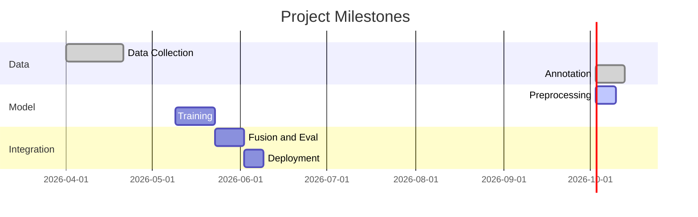
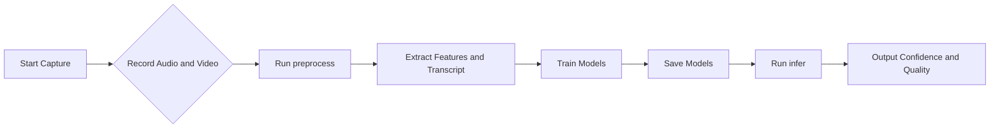

# Multimodal Viva-Evaluator

## Executive Summary
This project implements a multimodal AI system to evaluate viva (oral exam) performance by analyzing speech audio, facial expressions, hand gestures, and transcript content. It includes data recording, preprocessing, model training, and inference scripts. The system uses MediaPipe for face/hand landmarks, OpenAI Whisper for transcription, and separate models (LSTM/CNN) per modality, with a fusion layer for final confidence and quality scoring.

Assumptions: English (en-US) answers; no ready dataset (we generate synthetic samples).

## Folder Structure

```
VivaEvaluator/
├── data/
│   ├── raw/          # Raw recordings (mp4, wav) and transcripts
│   ├── features/     # Extracted feature files (JSON/HDF5)
│   └── models/       # Trained model checkpoints (.pt/.pkl)
│
├── notebooks/        # Jupyter notebooks for experiments
│
├── src/              # Source code
│   ├── cli/          # Thin entrypoints (scripts)
│   ├── application/  # Use-cases, orchestration, training/inference
│   ├── domain/       # Entities and value objects
│   └── infrastructure/ # IO + external tools (MediaPipe, Whisper, OpenCV)
│
├── requirements.txt  # Python package dependencies
├── README.md         # This file
└── .gitignore        # Ignored files (envs, data)
```

## Installation

### Windows
Ensure Python 3.8+ is installed and `pip` is available. Install `ffmpeg` via winget or from ffmpeg.org.

### Python Environment
Create a virtual environment and activate it:

```powershell
python -m venv venv
.\venv\Scripts\Activate.ps1
```

### Python Packages
Install required packages:

```bash
pip install -r requirements.txt
```

CUDA note: For GPU support with PyTorch, install the appropriate torch+cu build from PyTorch.org.

## Sample Data Format

We store extracted features in JSON. Example structure:

```json
{
  "id": "sample1",
  "transcript": "The answer goes here.",
  "audio_features": {
    "mfcc": [[0.1, -12.3], [0.2, -11.9]],
    "pitch": [120.5, 119.0]
  },
  "face_landmarks": [[0.52, 0.47, 0.01], [0.53, 0.48, 0.02]],
  "hand_landmarks": [[0.30, 0.60, 0.01], [0.31, 0.59, 0.02]],
  "labels": {"confidence": 2, "quality": 1}
}
```

## Scripts

### 1) Capture

```powershell
python -m src.cli.capture
```

### 2) Preprocess

```powershell
python -m src.cli.preprocess
```

### 3) Train (stub)

```powershell
python -m src.cli.train_stub
```

### 4) Infer (stub)

```powershell
python -m src.cli.infer_stub
```

## Running the Code
1. Create the environment.
2. Capture data with `python -m src.cli.capture` (adjust duration if needed).
3. Preprocess with `python -m src.cli.preprocess`.
4. Train a stub model with `python -m src.cli.train_stub`.
5. Run inference with `python -m src.cli.infer_stub`.

Hyperparameters:
- LSTM hidden size: 16 (demo); scale up (e.g., 64) for real data.
- Learning rate: 1e-3; try 1e-4 if training is unstable.
- Epochs: the stub uses 1 epoch; set 10 to 20 epochs for real training with validation checks.

## Timeline and Flowchart





## License and Gitignore
- License: MIT (permissive open-source).
- .gitignore: example entries:
```
venv/
__pycache__/
*.pyc
data/raw/
data/models/
```
