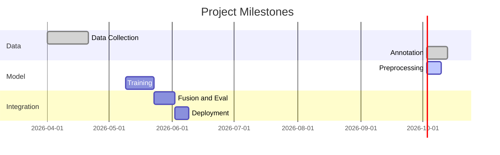

# Multimodal Viva-Evaluator

## Executive Summary

This project is a multimodal pipeline to evaluate viva (oral exam) performance using **speech audio**, **face mesh landmarks**, **hand landmarks**, **full-body pose** (MediaPipe Pose), **dominant emotions** (DeepFace on sampled frames), and a **spoken transcript**. Preprocessing builds a combined **`final_features`** object plus legacy top-level keys for existing trainers. Training still uses lightweight PyTorch models for audio, face, and hand streams, with a **simple mean fusion** at inference.

**Assumptions:** English (`en-US`) answers; no bundled dataset (training can fall back to synthetic tensors when labels or data are insufficient).

**Implementation status:**

| Area | Status |
|------|--------|
| Capture (webcam → MP4 + WAV) | Implemented (`OpenCV` + `sounddevice`) |
| Audio features | MFCC, F0 (`librosa` + Parselmouth/YIN), plus **tempo**, **ZCR**, **RMS energy** |
| Vision | MediaPipe **Face Mesh**, **Hands**, **Pose**; **DeepFace** `emotion` every 10th frame |
| Hand gesture stats | **Mean movement** between consecutive hand poses (`gesture_features.compute_hand_movement`) |
| Transcript | `openai-whisper` |
| Training | Audio LSTM stub; face **CNN+LSTM**; hand **LSTM**; may use **synthetic** data if labels are insufficient |
| Inference | Three checkpoints; **fused score = mean** of audio / face / hand probabilities |
| Transcript in models | Stored in JSON; **not** yet in training or fusion |
| `xgboost`, `scikit-learn`, `transformers` | In `requirements.txt`; **not** wired in current training code |

## Tech Stack (what the code uses)

- **PyTorch** — audio / face / hand classifiers and fusion in `infer_stub`
- **MediaPipe** — `FaceMesh`, `Hands`, `Pose` (`src/infrastructure/mediapipe_extractors.py`)
- **DeepFace** — `DeepFace.analyze(..., actions=['emotion'])` on every 10th frame (BGR frames from OpenCV)
- **OpenCV** — video read, capture (`cv2`)
- **OpenAI Whisper** — `src/infrastructure/asr_whisper.py`
- **librosa** + **praat-parselmouth** — `src/application/audio_features.py`
- **soundfile** / **sounddevice** — audio I/O alongside capture

## Folder Structure

```
VivaEvaluator/
├── data/
│   ├── raw/          # Recordings (mp4, wav); gitignored when populated
│   ├── features/     # Extracted feature JSON; gitignored when populated
│   └── models/       # Saved .pth checkpoints; gitignored when populated
│
├── notebooks/        # Optional; add for experiments
│
├── src/
│   ├── cli/          # Entry points: capture, preprocess, train_stub, infer_stub
│   ├── application/  # Preprocess, audio + gesture features, training/inference stubs, face & hand models
│   ├── domain/       # Datatypes (e.g. FeatureSample)
│   └── infrastructure/  # capture_io, MediaPipe + DeepFace extractors, Whisper
│
├── requirements.txt
├── README.md
└── .gitignore
```

## Installation

### Windows

Use **Python 3.10+** recommended (PyTorch 2.x in `requirements.txt`). Install **ffmpeg** (e.g. winget or https://ffmpeg.org) for media tooling Whisper and others may expect.

**Note:** First run of **DeepFace** may download face/emotion weights; **MediaPipe** / **TensorFlow** logs on import are normal on Windows.

### Python environment

From the **`VivaEvaluator`** directory (so `src` imports resolve):

```powershell
python -m venv .venv
.\.venv\Scripts\Activate.ps1
pip install -r requirements.txt
```

CUDA: for GPU PyTorch, install the matching `torch` build from https://pytorch.org instead of or after the CPU wheel in `requirements.txt`.

## Feature bundle

Preprocessing (`preprocess_sample`) produces:

- **Top-level (backward-compatible):** `face_landmarks`, `hand_landmarks`, `audio_features`, `transcript`, `labels`
- **New:** `pose_features` (per-frame 33 pose landmarks × `[x,y,z]`), `emotion_results` (dominant emotion strings from sampled frames), `hand_gesture_stats.movement_mean`
- **`final_features`:** single object combining modalities:

```json
{
  "face": "<same as face_landmarks>",
  "hands": "<same as hand_landmarks>",
  "pose": "<pose_features>",
  "emotion": "<emotion_results>",
  "audio": "<audio_features>"
}
```

## Sample feature JSON (abbreviated)

- **`face_landmarks`:** list of frames, each **468** `[x, y, z]` points (Face Mesh).
- **`pose_features`:** list of frames, each **33** pose landmarks.
- **`hand_landmarks`:** sequence of detected hands (**21** points each).
- **`emotion_results`:** dominant emotion per sampled frame (DeepFace labels, e.g. `happy`, `neutral`, `fear`, `sad`).
- **`audio_features`:** `mfcc`, `pitch`, `tempo`, `zcr`, `energy`.

```json
{
  "id": "sample",
  "transcript": "The answer goes here.",
  "audio_features": {
    "mfcc": [[0.1, -12.3, 0.0]],
    "pitch": [120.5],
    "tempo": 118.5,
    "zcr": 0.12,
    "energy": 0.05
  },
  "face_landmarks": [],
  "hand_landmarks": [],
  "pose_features": [],
  "emotion_results": ["neutral", "happy"],
  "hand_gesture_stats": {"movement_mean": 0.02},
  "final_features": {
    "face": [],
    "hands": [],
    "pose": [],
    "emotion": ["neutral", "happy"],
    "audio": {}
  },
  "labels": {"confidence": 0, "quality": 0}
}
```

Set `labels` before training if you want face/hand models to learn from real files (`labels.confidence`).

## CLI (run from `VivaEvaluator/`)

### 1) Capture

```powershell
python -m src.cli.capture --duration 10 --fps 20 --width 640 --height 480
```

Writes under `data/raw/` (see `src/infrastructure/capture_io.py`).

### 2) Preprocess

Requires a video and audio path (defaults: first `*.mp4` and `*.wav` in `data/raw/`).

```powershell
python -m src.cli.preprocess --video data/raw/your.mp4 --audio data/raw/your.wav --model small --out sample_features.json
```

`--model` is the Whisper size (`tiny`, `base`, `small`, …). First run downloads Whisper weights. **Preprocess is heavier** now (Pose + DeepFace + MediaPipe).

### 3) Train (stub + face + hand)

```powershell
python -m src.cli.train_stub
```

Saves `audio_model.pth`, `face_model.pth`, `hand_model.pth` under `data/models/`. Uses `data/features/sample_features.json` when present and sufficiently labeled; otherwise synthetic data for face/hand.

### 4) Infer (stub + fusion)

```powershell
python -m src.cli.infer_stub
```

Prints audio, face, and hand probabilities and a **mean** fused score.

## Typical workflow

1. Create and activate the venv; `pip install -r requirements.txt`.
2. `python -m src.cli.capture` (adjust `--duration` if needed).
3. `python -m src.cli.preprocess` (pass `--video` / `--audio` or ensure files exist in `data/raw/`).
4. `python -m src.cli.train_stub`.
5. `python -m src.cli.infer_stub`.

**Hyperparameters (stubs):** audio LSTM uses hidden size **16** and input dim **4** on random data; face model uses CNN+LSTM in `facial_expression_model.py`; hand model uses LSTM in `hand_gesture_model.py`. Increase epochs and data volume for real experiments.

## Timeline and Flowchart




## License and `.gitignore`

- **License:** No `LICENSE` file is in this repo yet; add one if you distribute the project.
- **`.gitignore`** includes `venv/`, `.venv/`, `data/raw/`, `data/models/`, `data/features/`, and common caches — adjust if you want to version sample data or checkpoints.
